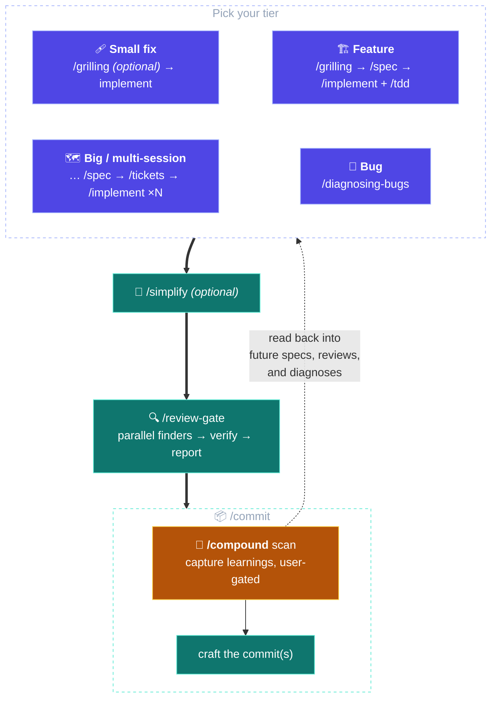
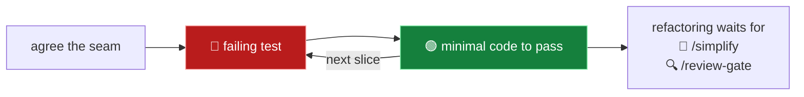
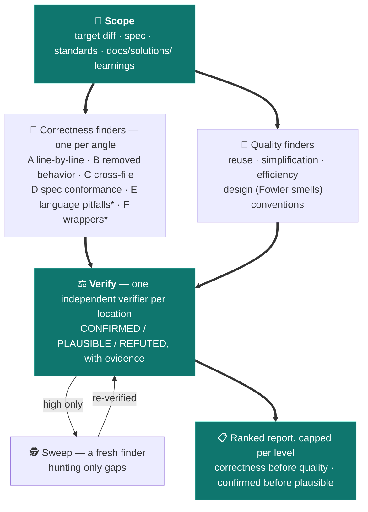
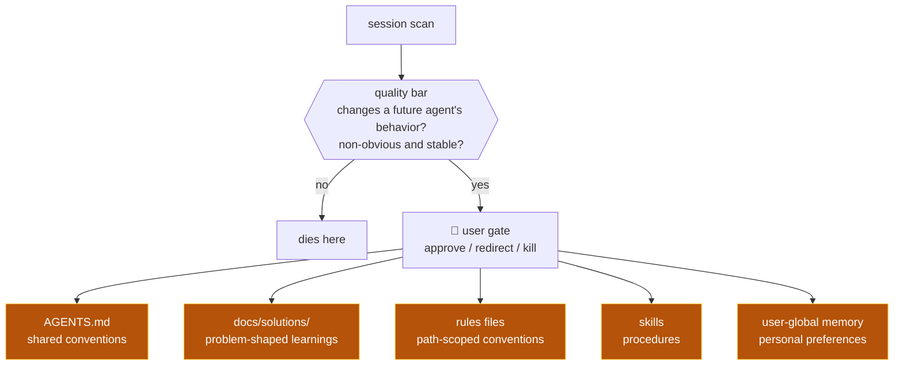
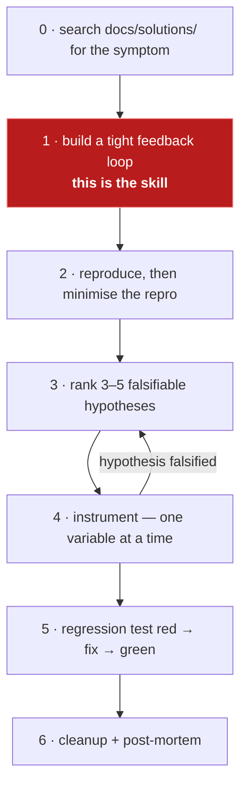

<div align="center">

# 🪄 grimoire

**A marketplace of curated agent skills for Claude Code and Codex CLI.**

One coherent engineering loop — grill, spec, implement, review, commit — that _remembers what it
learns_, plus an agent-driven installer that pulls versioned rules, hooks, and templates from any
git repo and keeps them updatable.

Forked from and inspired by [Matt Pocock's skills](https://github.com/mattpocock/skills) and
[Every's Compound Engineering](https://github.com/EveryInc/compound-engineering-plugin).

[Plugins](#plugins) · [The loop](#cantrips--the-engineering-loop) ·
[The skills](#the-loop-skill-by-skill) · [Wards](#wards--the-scroll-installer) ·
[Install](#install) · [Development](#development)

</div>

---

## Plugins

| Plugin               | Gives your agent…                                                                                                                                                             | Type        |
| -------------------- | ----------------------------------------------------------------------------------------------------------------------------------------------------------------------------- | ----------- |
| ✨&nbsp;**cantrips** | The core engineering loop: `/grilling` → `/spec` → `/implement` (TDD at agreed seams) → `/review-gate` → `/commit` → `/compound`.                                             | Skills      |
| 🛡️&nbsp;**wards**    | An agent-driven installer that transcribes rules, hooks, and templates ("scrolls") from any git repo into your project, with provenance-tracked, judgment-preserving updates. | Skill + CLI |

> Plugin names are plain; skill names are plain and verb-like (`/spec`, `/implement`,
> `/compound`) — the plugin namespace disambiguates.

## cantrips — the engineering loop

> _Basic spells a caster always has prepared._

Cantrips forks the best of [mattpocock/skills](https://github.com/mattpocock/skills) and
[EveryInc/compound-engineering-plugin](https://github.com/EveryInc/compound-engineering-plugin)
into one coherent pipeline: **Pocock to steer, a Compound-Engineering-style pipeline to execute
and remember.**

### A loop that navigates itself

Cantrips is not a bag of independent commands — it is one dynamic, discoverable loop:

- **Every pipeline skill ends by naming the next step** and whether to take it in this session or
  break to a fresh one, so you never memorize the pipeline — the loop tells you where you are.
- **Two invocation modes.** Deliberate gates (🧑) only fire when you type them; reflexes (🤖) fire
  on their own when their triggers match — `/tdd` when you build test-first, `/compound` when a
  learning surfaces, `/prototype` when a design question needs empirical evidence.
- **Skills brief each other.** The spec records the seams `/tdd` will bite at; `/implement`
  suggests a `/review-gate` effort level scaled to the diff it just produced; `/review-gate` flags
  compound-worthy findings for `/commit`'s learnings scan.
- **The loop remembers.** `/compound` routes what a session learned into knowledge stores, and
  `/spec`, `/review-gate`, and `/diagnosing-bugs` read those stores back — each unit of work makes
  the next one easier.

### The tiers

Each tier only adds ceremony when the work warrants it:



- **Small fix:** `/grilling` (optional) → implement directly → `/review-gate` → `/commit`.
- **Feature:** `/grilling` → `/spec` → `/implement` in a fresh context, driving `/tdd` at the test
  seams agreed in the spec → [`/simplify`] → `/review-gate` → `/commit`.
- **Big / multi-session:** insert `/tickets` between spec and implement; one ticket per fresh
  context window.
- **Bugs** enter through `/diagnosing-bugs` instead of grill/spec; the root cause becomes a
  learning at commit time.
- `/handoff` breaks context at any tier (compaction for resuming — never a substitute for a spec).

### The compounding system

The part that makes each unit of work easier than the last:

- **`/compound`** fires inside `/commit`'s opening scan (or typed ad-hoc, or agent-fired when a
  learning surfaces mid-session), scans the session for learnings that would change a future
  agent's behavior — non-obvious and stable ones only — and routes each to the right store: the
  project's `AGENTS.md`, a `docs/solutions/` entry, a rules file, a skill, or your user-global
  memory file (`CLAUDE.md`, `AGENTS.md`, or your harness's equivalent). **Every write is
  user-gated**: approve, redirect, or kill.
- **Read-back arrows:** `/spec`, `/review-gate`, and `/diagnosing-bugs` search `docs/solutions/`
  and past specs, so captured knowledge actually gets used.
- **`/compound-refresh`** garbage-collects the stores when they age: audits `docs/solutions/`
  against the current code and `AGENTS.md` for bloat and contradictions.

### Full roster

Each skill name links to its section below; each skill's `SKILL.md` under
[plugins/cantrips/skills/](plugins/cantrips/skills/) is the authoritative source. 🧑 you type it;
🤖 the agent loads it on its own when its triggers match (agent-invokable skills show both — you
can still type them).

**The loop:**

| Skill                                  | Invoked by | Role                                                                         |
| -------------------------------------- | ---------- | ---------------------------------------------------------------------------- |
| [`/grilling`](#grilling)               | 🧑🤖       | Relentless one-question-at-a-time interview to stress-test the plan.         |
| [`/spec`](#spec)                       | 🧑         | Turn the conversation into `docs/specs/<feature>.md`, test seams included.   |
| [`/tickets`](#tickets)                 | 🧑         | Slice a big spec into tracer-bullet tickets, one per fresh context.          |
| [`/implement`](#implement)             | 🧑         | Execute the spec or one ticket, driving `tdd` at the agreed seams.           |
| [`/tdd`](#tdd)                         | 🧑🤖       | Red-green-refactor discipline, with its anti-patterns catalogue.             |
| [`/simplify`](#simplify)               | 🧑         | Optional behavior-preserving quality pass before review.                     |
| [`/review-gate`](#review-gate)         | 🧑         | The gate: effort-scaled finder angles, every finding independently verified. |
| [`/commit`](#commit)                   | 🧑         | Scan the session for learnings, then craft the commit(s).                    |
| [`/compound`](#compound)               | 🧑🤖       | Route each learning to the right store — every write user-gated.             |
| [`/diagnosing-bugs`](#diagnosing-bugs) | 🧑🤖       | The bug entry point: diagnosis loop replacing grill/spec.                    |

**The utilities:**

| Skill                                                              | Invoked by | Role                                                                       |
| ------------------------------------------------------------------ | ---------- | -------------------------------------------------------------------------- |
| [`/compound-refresh`](#compound-refresh)                           | 🧑         | Garbage-collect `docs/solutions/` and `AGENTS.md` when they age.           |
| [`/handoff`](#handoff)                                             | 🧑         | Compact the session into a handoff for a fresh context.                    |
| [`/prototype`](#prototype)                                         | 🧑🤖       | Throwaway prototype to answer a design question empirically.               |
| [`/research`](#research)                                           | 🧑🤖       | Background primary-source research, captured in the repo.                  |
| [`/resolving-merge-conflicts`](#resolving-merge-conflicts)         | 🧑🤖       | Principled merge/rebase conflict resolution.                               |
| [`/codebase-design`](#codebase-design)                             | 🧑🤖       | Deep-module vocabulary other skills lean on.                               |
| [`/improve-codebase-architecture`](#improve-codebase-architecture) | 🧑         | Scan for module-deepening opportunities.                                   |
| [`/teach`](#teach)                                                 | 🧑         | Learn a concept from this workspace, tutor-style.                          |
| [`/writing-great-skills`](#writing-great-skills)                   | 🧑🤖       | The authoring standard, loaded before editing skills, AGENTS.md, or rules. |

### The loop, skill by skill

#### `/grilling`

**A relentless, one-question-at-a-time interview that stress-tests a plan before any code exists.**

- **When to use** — before `/spec` on anything non-trivial, or whenever a decision deserves
  pressure. Fires on its own when you ask to be grilled or requirements are fuzzy.
- **The intent** — agents default to agreeable: they fill gaps with silent assumptions and build
  the wrong thing confidently. Grilling inverts the posture. Facts are looked up in the
  environment; _decisions_ are yours, put to you one at a time.
- **How it works** — questions are numbered across the interview (Q1, Q2, …); when candidates can
  be enumerated they come as lettered options with the recommendation first. A decision that needs
  empirical evidence routes to `/prototype`; one that hinges on external facts routes to
  `/research`. The interview closes only when every branch of the decision tree is resolved.
- **Next** — `/spec` for feature-sized outcomes (same session — it synthesizes the interview),
  `/implement` directly for small fixes.

#### `/spec`

**Synthesize the conversation into `docs/specs/<feature>.md` — the contract `/implement` executes
and `/review-gate` reviews against.**

- **When to use** — feature-sized work, once the decisions exist (usually right after `/grilling`).
- **The intent** — decisions decay in chat logs; a spec survives the session. It records the
  **test seams** you approve up front, so implementation can TDD without relitigating design, and
  its requirements are what the review gate's spec angle later checks the diff against.
- **How it works** — explores the repo, folds in matching `docs/solutions/` learnings and past
  specs, proposes the seams (approved by you before writing), then writes the spec: problem,
  solution, user stories, implementation decisions, test seams, out of scope.
- **Next** — `/tickets` when the work spans sessions, else `/implement` — a fresh context either
  way; the spec _is_ the context.

#### `/tickets`

**Slice a big spec into tracer-bullet tickets, one per fresh context window.**

- **When to use** — the spec is too big for one session.
- **The intent** — context windows are the real budget. Each ticket is a **vertical slice**
  (schema to UI to tests) that lands demoable and green on its own; **blocking edges** between
  tickets expose which ones can start immediately. Wide mechanical refactors get expand–contract
  sequencing instead of a forced vertical cut.
- **How it works** — drafts the slices, quizzes you on granularity and edges until you approve,
  then writes `docs/specs/<feature>/NN-<slug>.md` files with acceptance criteria.
- **Next** — `/implement`, one ticket per fresh context, working the frontier of unblocked
  tickets.

#### `/implement`

**Execute the spec or one ticket, driving `/tdd` at the agreed seams.**

- **When to use** — a fresh session holding a spec or ticket.
- **The intent** — deciding and building are separated on purpose: the spec already carries the
  decisions and the approved seams, so implementation tests at them without re-asking, and states
  explicit verification criteria wherever no seam was agreed.
- **How it works** — reads the spec or ticket in full, drives `/tdd` at the agreed seams,
  typechecks and runs scoped tests continuously, ticks acceptance criteria as each is verified,
  and finishes with the full suite.
- **Next** — `/simplify` (optional), then `/review-gate` with a suggested effort level scaled to
  the diff it just produced, then `/commit` — all in-session; the working diff is the context.

#### `/tdd`

**The red → green loop, plus the reference that makes it produce tests worth keeping.**

- **When to use** — building features or fixing bugs test-first. Fires on its own when you mention
  red-green-refactor or test-first work.
- **The intent** — agent-written test suites rot in three named ways the skill blocks:
  **implementation-coupled** tests that break on refactor, **tautological** assertions that
  recompute the expected value the way the code does, and **horizontal slicing** (all tests first,
  then all code) that verifies imagined behavior. Tests live only at **seams** you agreed — via
  the spec, or confirmed before the first test — so effort lands on critical paths.



- **Next** — refactoring is deliberately not part of the cycle; it belongs to the review tail,
  `/simplify` and `/review-gate`.

#### `/simplify`

**An optional behavior-preserving quality pass between implementation and review.**

- **When to use** — the diff works but feels heavier than the problem deserved.
- **The intent** — cleanup and bug-hunting are different jobs; this one only cleans. Three
  parallel reviewer personas (reuse, quality, efficiency) propose fixes; every fix must preserve
  exact behavior, and **safety checks are never simplified away** — code that drops one is not
  simpler, it is unfinished.
- **How it works** — resolves the scope (your words, or the branch diff), dispatches the personas,
  applies the worthwhile findings directly, then verifies with typecheck, lint, and tests scoped
  to the blast radius.
- **Next** — `/review-gate`, in this session, with a suggested effort level scaled to the diff.

#### `/review-gate`

**The gate between implementation and commit: effort-scaled, multi-angle review of the working
diff (or the changes since a fixed point), every finding independently verified.**

- **When to use** — after implementation and the optional `/simplify`, before `/commit`. Pick the
  effort level — upstream skills suggest one scaled to the diff: `low` for a trivial or mechanical
  diff, `high` for a large, cross-cutting, or risky one, `medium` otherwise.
- **The intent** — a single reviewer reading a diff top to bottom misses bugs for two reasons:
  attention dilutes across concerns, and the finder of a candidate bug is a poor judge of it. The
  gate fixes both. **Finders** each hold exactly one concern; **verifiers** judge every candidate
  independently, so a finder never silently drops a bug it half-believes. A dedicated **spec
  angle** compares the diff against the spec's requirements — catching "built the wrong thing
  correctly", which no code-only review can — and matched `docs/solutions/` learnings are re-checked
  by every finder, so past root causes stay caught.



<sup>\* `high` effort only.</sup>

- **How it works** — three effort levels: `low` is one inline diff pass (≤4 findings); `medium`
  dispatches 4 correctness + 2 quality finders reviewing for **precision** (≤8); `high` dispatches
  6 correctness + 5 quality finders reviewing for **recall**, then a gap-hunting sweep (≤15).
  Finders run as parallel sub-agents, each briefed on a single angle or lens; every candidate must
  name a concrete failure scenario. Verifiers judge per location and refuted or unverified
  candidates never reach the report. Findings flow through the harness's typed findings tool where
  one exists; `--fix` applies the surviving findings on the spot. On a harness without sub-agents
  (Codex CLI), the same angles run inline as a single-pass review that says so.
- **Next** — fix what's worth fixing, re-run after substantial fixes, then `/commit`. Findings
  that exposed a durable gotcha are flagged as `/compound` material for commit's opening scan.

#### `/commit`

**Close the loop: harvest the session's learnings, then craft the commit(s).**

- **When to use** — the gate has passed and the tree holds the finished work.
- **The intent** — the learnings scan comes _first_ so `/compound`'s approved writes join the
  working tree and ride into the same commit ceremony, instead of dirtying the tree right after
  you committed. Messages communicate value ("why"), follow the repo's observed convention, and
  distinct concerns split into at most two or three file-level commits.
- **How it works** — scans the session for compound candidates and invokes `/compound` when any
  might clear its bar; then gathers git context, picks the branch per the repo's workflow,
  matches the message convention, and stages files by name, group by group.
- **Next** — the loop is closed; the next unit of work deserves a fresh session.

#### `/compound`

**The loop's memory: capture durable learnings and route each to the right knowledge store, every
write user-gated.**

- **When to use** — `/commit`'s opening scan invokes it with candidates; `/diagnosing-bugs` closes
  out through it; it also fires ad-hoc when you ask to capture or remember something.
- **The intent** — automatic memory fails by hoarding trivia. Every candidate faces a two-part
  quality bar — _would it change a future agent's behavior in a different session, and is it
  non-obvious and stable?_ — and session-specific noise dies there. Survivors go to the cheapest
  store that serves them, and nothing is ever written without your approval.



- **Next** — the writes join the working tree; `/commit`'s flow picks them up.

#### `/diagnosing-bugs`

**The bug entry point: a feedback-loop-first diagnosis discipline that replaces grill/spec.**

- **When to use** — something is broken, throwing, failing, or slow. Fires on its own on
  "diagnose" or "debug this".
- **The intent** — in the skill's own words, the feedback loop _is_ the skill; everything else is
  mechanical. A **tight**, red-capable, deterministic repro command is built before any theory is
  entertained — jumping straight to a hypothesis is the exact failure the skill prevents — and
  hypotheses are generated 3–5 at a time, each falsifiable, because single-hypothesis debugging
  anchors on the first plausible idea.



- **Next** — `/review-gate` the fix, then `/commit`, whose opening scan turns the root cause, the
  gotchas, and what didn't work into a `docs/solutions/` learning.

### The utilities, skill by skill

#### `/compound-refresh`

**Garbage collection for the knowledge stores.** Audits every `docs/solutions/` doc against the
current code (cited paths still exist, the fix still matches reality) and `AGENTS.md` for bloat,
contradictions, and staleness. Verdict per doc — keep, update, consolidate, or delete — with the
prime directive _match docs to reality, never the reverse_; every change is user-gated. Run it
when the stores feel stale, not on a schedule.

#### `/handoff`

**Compaction for resuming work.** Writes a handoff document to the OS temp directory — outside the
workspace — that a fresh session can pick up: state, references to specs and commits by path, and
a suggested-skills section naming what the next session should invoke. Deliberately _not_ a spec
substitute: decisions that should outlive the session go to `docs/specs/` first.

#### `/prototype`

**Throwaway code that answers a design question.** Two branches: a logic question gets a tiny
interactive terminal app that pushes the state model through hard cases; a UI question gets
radically different variations switchable on one route. No tests, no polish, no persistence — and
when the question is answered, the validated decision folds into the real code while the prototype
itself is committed to a throwaway branch as a primary source. Fires on its own when a `/grilling`
decision needs empirical evidence.

#### `/research`

**Background primary-source research.** Spins up a background agent so the session keeps working
while it reads. Official docs, source code, specs — never a secondary write-up — with every claim
cited, captured as a Markdown file where the repo keeps such notes. Fires on its own when a
question hinges on facts living outside the codebase.

#### `/resolving-merge-conflicts`

**Principled conflict resolution.** Reads the primary sources behind each conflicting change —
commit messages, PRs, the specs in `docs/specs/` — resolves each hunk preserving both intents
where possible, never inventing behavior and never aborting, then runs the project's checks and
finishes the merge or rebase.

#### `/codebase-design`

**The deep-module vocabulary the rest of the loop leans on.** Module, interface, seam, adapter,
depth, leverage, locality, the deletion test — used exactly, so design conversations, specs, and
reviews share one language. `/spec` uses it to place test seams, `/review-gate`'s design lens
judges in it, `/improve-codebase-architecture` is built on it. Also carries the deepening playbook
and a design-it-twice pattern that explores alternative interfaces with parallel sub-agents.

#### `/improve-codebase-architecture`

**A deepening-opportunity scan.** Walks the codebase's hot spots (recent-change history first),
hunts shallow modules and friction with the deletion test, and presents candidates as a
self-contained HTML report — before/after diagrams, locality/leverage benefits, recommendation
strength. Pick one and it grills you through the redesign decision tree.

#### `/teach`

**A tutor that lives in a workspace.** Grounds every lesson in your stated mission, tracks
resources and learning records, and produces short, beautiful, self-contained HTML lessons built
for retention — retrieval practice, spacing, tight feedback loops — with printable reference
sheets as the durable output.

#### `/writing-great-skills`

**The authoring standard behind every skill in this repo.** Predictability as the root virtue:
leading words, checkable completion criteria, progressive disclosure, positive phrasing, no
no-ops, prune sediment. Loaded before editing any skill, `AGENTS.md`, or rules file — a session
that only reads them leaves it unloaded.

## wards — the scroll installer

> _Protective spells that trigger at a boundary._

A **scroll** is a single self-describing file — a **rule**, a **hook**, or a **template** — carrying
`ward:` metadata. Wards transcribes scrolls from any git repository into your project (or your
user-global config), where they are committed and versioned like any other file. It is not a
skill and a hook anymore; it is one user-invoked `/wards` skill driving a zero-dependency TypeScript
CLI. You supply the judgment — which scrolls, what to customize, how to merge — and the CLI supplies
the mechanics: cloning, scanning, version comparison, three-way-merge materialization.

### Not a static copier

Tools like `npx skills` copy a file into your repo and record where it came from, but that is where
the relationship ends: no way to pull the author's later fixes without hand-diffing, no notion of
your local edits. Wards is dynamic where those are static:

- **It tracks provenance.** Every installed scroll records its source, its path within that source,
  and the exact version (or commit) it came from — so an update knows precisely what to compare
  against.
- **It preserves your changes.** Relax a line limit or trim a section at install time and that delta
  is written into the file's provenance as a prose note; updates read it as context and merge around
  it instead of clobbering it.
- **It installs more than skills.** Rules with glob-scoped loading, executable hooks wired into your
  settings, AGENTS.md templates, and even _foreign_ files from a repo that never heard of wards — any
  document on GitHub, one command from being a managed, updatable part of your project.
- **It speaks both harnesses from one file.** The canonical scroll lives once under `.agents/`; wards
  derives the Claude Code and Codex CLI integrations from it, so they never drift.

### How a scroll lands

`/wards install <source>` runs an interview, not a copy:

1. **The offering.** Wards clones the source, scans it for files carrying `ward:` metadata (there is
   **no manifest** — the files are self-describing), and shows you what's on offer: each scroll's
   kind, description, applicability globs, and recommended scope.
2. **Scope.** Each scroll suggests `project` (committed with the repo, applies to every contributor)
   or `user` (follows you across projects, under `~/.agents/`); you confirm or override.
3. **The customization dialog.** Before a scroll lands, wards offers to adapt it to your project —
   say, loosening a rule to match your codebase's reality. Each change you accept becomes a delta
   note in the file's provenance.
4. **The canonical write.** The scroll is written into `.agents/rules/` or `.agents/hooks/` with a
   `ward.provenance` entry. The provenance is a _list_, because a composite file (an AGENTS.md that
   is both a template descendant and a managed pointer block) can aggregate several upstreams.
5. **The integrations.** For each harness present, wards derives the wiring: Claude Code gets a
   symlink under `.claude/rules/` with the globs translated to `paths:` frontmatter (a wards-managed
   copy where symlinks don't work), and hooks wired into the committed `.claude/settings.json`; Codex
   CLI gets a clearly-marked managed block in `AGENTS.md` with conditional pointer lines. You edit
   only the canonical file — wards owns the derivations and regenerates them.

### How an update stays yours

`/wards update` finds drift from the recorded provenance (no source to name — it's inferred from what
you installed), then, for each outdated scroll, performs a three-way merge: your local file, the old
upstream baseline recovered from the source's git history, and the new upstream, via `git
merge-file`. Conflicts are resolved by the agent — using your delta notes as the reason your side
diverges — not by discarding one side. Unversioned upstreams are tracked by commit hash so updates
work even without version numbers. **Templates** get a gentler posture: an AGENTS.md diverges ~100%
by design, so wards diffs old-template against new-template and proposes the _structural_
improvements against your customized file, never re-transcribing it.

`/wards status` classifies every installed scroll across both scopes, with the recorded-versus-source
detail, so you can see drift at a glance: **up-to-date**, **outdated**, **unverified** (nothing could
be compared — an unreachable source, a path that moved upstream), **foreign** (present but
unmanaged), or **invalid** (the ward header does not parse, with the diagnostics to fix it).

### Sources: bring your own

Wards ships with **no baked-in default source** — it carries no one's opinions. A source is a git
URL, an `owner/repo` GitHub shorthand, or a local path, each with an optional `#ref`; private repos
work through your existing git auth. This repo's [`example-scrolls/`](example-scrolls/) is exactly
that — an _example_ source you can point wards at, not a blessed registry:

| Scroll                  | Kind     | Applies to             | Scope   |
| ----------------------- | -------- | ---------------------- | ------- |
| `general-code-style`    | rule     | every file             | project |
| `typescript-code-style` | rule     | TypeScript / JS files  | project |
| `cs-code-style`         | rule     | `**/*.cs`              | project |
| `general-guidelines`    | rule     | always loaded          | user    |
| `check-line-length`     | hook     | fires after file edits | project |
| `agents-md-template`    | template | AGENTS.md scaffold     | project |

These are opinionated — breathing room, a hard 100-character limit, high-value comments, a compact
AGENTS.md skeleton wired for the cantrips conventions. Install the ones whose taste you share, or
fork them into your own source. A personal default source belongs in your own global `CLAUDE.md`,
per the repo's personalization philosophy — never hardcoded into the tool.

Grimoire dogfoods this: its own `.agents/` is populated by a real `/wards install`, so the end-to-end
flow is exercised continuously.

### Authoring your own scrolls

Point wards at your repo and any file that carries a top-level `ward:` mapping becomes a scroll —
**no manifest, nothing to keep in sync.** Markdown scrolls carry the metadata as YAML frontmatter:

```markdown
---
ward:
  kind: rule
  description: Language-agnostic code style — line breaks, comments, docblocks.
  version: 2.1.0
  applicability:
    - '**/*'
  scope: project
---

# General Code Style

…
```

Executable scrolls (hooks) carry the same YAML in a leading **line-comment header** — so a hook stays
a single self-contained file in any language. The parser auto-detects the comment token from the
first line (`//`, `#`, `--`, `;`) and strips it:

```ts
// ward:
//   kind: hook
//   description: Flag source lines exceeding the 100-character limit right after an edit.
//   version: 2.1.0
//   scope: project
//   event: fires-after-file-edit

// PostToolUse hook: warns when a file it just edited exceeds the limit.
…
```

The source-side fields (the installer writes the `provenance` list itself):

| Field           | Required | Notes                                                                  |
| --------------- | -------- | ---------------------------------------------------------------------- |
| `kind`          | yes      | `rule`, `hook`, or `template` — fixes the file shape and integration.  |
| `description`   | yes      | One-line human summary shown in a source's offering.                   |
| `version`       | yes      | Per-scroll semver, hand-bumped on every content change.                |
| `applicability` | no       | Neutral globs the scroll applies to; omit for an always-loaded scroll. |
| `scope`         | no       | Recommended install scope (`project`/`user`), overridable at install.  |
| `event`         | no       | Hooks only: the neutral trigger, currently `fires-after-file-edit`.    |

The grammar's single source of truth is
[plugins/wards/cli/ward-grammar.ts](plugins/wards/cli/ward-grammar.ts), and CI fails when the tables
above drift from it. The CLI's `validate` subcommand checks a whole tree against the same grammar,
and CI runs it over `example-scrolls/`, so a malformed header fails the build, not a user's install.

## Install

Add the marketplace once, then install the plugin(s) you want.

### Claude Code

```
/plugin marketplace add toverux/grimoire
/plugin install cantrips@grimoire
/plugin install wards@grimoire
```

Or from your terminal: `claude plugin marketplace add …` / `claude plugin install …` with the same
arguments.

### Codex CLI

```sh
codex plugin marketplace add toverux/grimoire
codex plugin add cantrips@grimoire
codex plugin add wards@grimoire
```

> [!IMPORTANT]
> **Migrating from the upstreams?** Cantrips _replaces_ the Matt Pocock skills and the
> Compound Engineering plugin it forks (renamed: `to-spec` → `/spec`, `ce-commit` → `/commit`,
> `code-review` → `/review-gate`, …). Uninstall those first, or the duplicate triggers will fight
> each other.

## Development

```sh
bun install    # install tooling deps (also installs the git hooks)
mise check     # verify (read-only): type-check, lint, format, manifest sync
mise fix       # auto-fix lint + format in place
```

See [AGENTS.md](AGENTS.md) for the architecture, authoring standards, and release process
(release-please, per-plugin versioning). Deferred ideas live in [IDEAS.md](IDEAS.md); the v1
design spec in [docs/specs/grimoire-v1.md](docs/specs/grimoire-v1.md).

### Trying your changes locally

The fastest loop is Claude Code's dev mode — it loads a plugin straight from the working tree,
session-scoped, no install (repeat the flag per plugin):

```sh
claude --plugin-dir path/to/grimoire/plugins/cantrips --plugin-dir path/to/grimoire/plugins/wards
```

To exercise the real install path instead, add the checkout itself as a marketplace — plain local
paths work in both harnesses:

```
/plugin marketplace add path/to/grimoire
/plugin install cantrips@grimoire
```

```sh
codex plugin marketplace add path/to/grimoire
codex plugin add cantrips@grimoire
```

Installs are copies, not links: after editing files, run `/reload-plugins` in a live Claude Code
session, or `/plugin marketplace update grimoire` and reinstall to refresh an install. The wards CLI
needs Node ≥ 22.6 on PATH (it runs as TypeScript via type stripping).

## License

MIT — see [LICENSE](LICENSE). Forked material is credited in [NOTICE.md](NOTICE.md)
([mattpocock/skills](https://github.com/mattpocock/skills), MIT, © Matt Pocock;
[EveryInc/compound-engineering-plugin](https://github.com/EveryInc/compound-engineering-plugin),
MIT, © Every); every forked skill records its upstream in its frontmatter `source` key.
