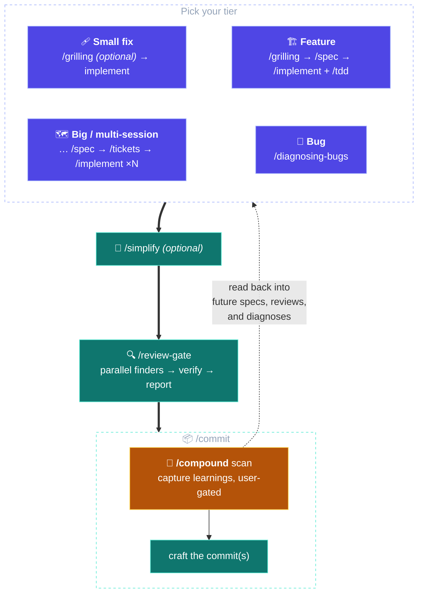
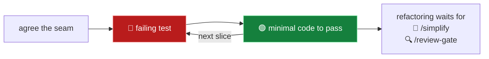
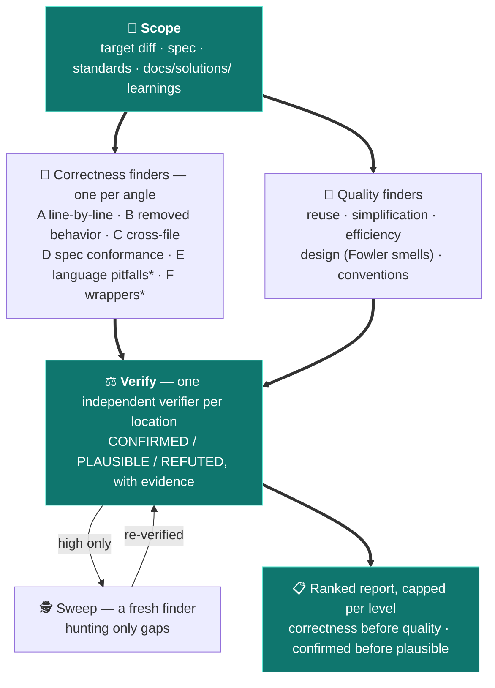
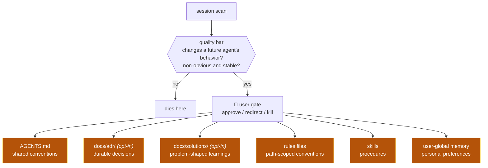
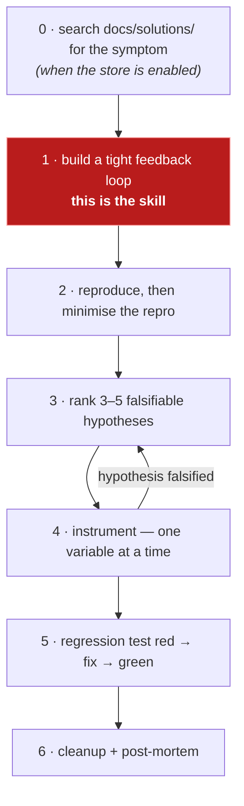

<div align="center">

# 🪄 cantrips

_“Basic spells a caster always has prepared.”_

**A curated set of agent skills for Claude Code and Codex.**

One coherent engineering loop — grill, spec, implement, review, commit — that _remembers what it
learns_. \
And a set of utilities for day to day needs.

Inspired by and kept in sync with [Matt Pocock's skills](https://github.com/mattpocock/skills) and
[Every's Compound Engineering](https://github.com/EveryInc/compound-engineering-plugin).

[The loop](#a-loop-that-navigates-itself) · [Storage](#pluggable-storage) ·
[The skills](#the-loop-skill-by-skill) · [Install](#install) · [Development](#development)

</div>

---

Most skill collections are a bag of independent commands: you memorize which one to type, and each
one starts from nothing. Cantrips is a single pipeline instead — `/grilling` → `/spec` →
`/implement` (TDD at agreed seams) → `/review-gate` → `/commit` → `/compound` — folding the best of
both upstreams into one shape: **Pocock to steer, a Compound-Engineering-style pipeline to execute
and remember.**

## A loop that navigates itself

Cantrips is not a bag of independent commands — it is one dynamic, discoverable loop:

- **Every pipeline skill ends by naming the next step** and whether to take it in this session or
  break to a fresh one, so you never memorize the pipeline — the loop tells you where you are.
- **Two invocation modes.** Deliberate gates (🧑) only fire when you type them; reflexes (🤖) fire
  on their own when their triggers match — `/tdd` when you build test-first, `/compound` when a
  learning surfaces, `/prototype` when a design question needs empirical evidence.
- **Skills brief each other.** The spec records the seams `/tdd` will bite at; `/implement`
  suggests a `/review-gate` effort level scaled to the diff it just produced; `/review-gate` flags
  compound-worthy findings for `/commit`'s learnings scan.
- **Storage is pluggable.** Skills speak six storage verbs, never a path or a CLI. Local markdown
  out of the box; a GitHub tracker, or your own described workflow, once you configure one.
- **The loop remembers.** `/compound` routes what a session learned into knowledge stores, and
  `/spec`, `/review-gate`, and `/diagnosing-bugs` read those stores back — each unit of work makes
  the next one easier.

## The tiers

Each tier only adds ceremony when the work warrants it:



- **Small fix:** `/grilling` (optional) → implement directly → `/review-gate` → `/commit`.
- **Feature:** `/grilling` → `/spec` → `/implement` in a fresh context, driving `/tdd` at the test
  seams agreed in the spec → [`/simplify`] → `/review-gate` → `/commit`.
- **Big / multi-session:** insert `/tickets` between spec and implement; one ticket per fresh
  context window.
- **Bugs** enter through `/diagnosing-bugs` instead of grill/spec; the root cause becomes a
  learning at commit time.
- `/handoff` breaks context at any tier (compaction for resuming — never a substitute for a spec).

## Pluggable storage

No skill hard-codes where a spec or a ticket lives. The storage-touching skills speak **six
verbs** — _publish_, _fetch_, and _annotate_ the spec; _publish_, _fetch_, and _resolve_ the
ticket — and one per-repo doc, `docs/agents/cantrips-loop.md`, translates each verb for the repo's
backend and lists which knowledge stores are enabled. When that doc is absent, the plugin's defaults
govern, so a bare install runs with no configuration step.

What lives where, by default:

| Artifact  | Default home                                  | Role                                                                           |
| --------- | --------------------------------------------- |--------------------------------------------------------------------------------|
| Specs     | `.scratch/<feature>/spec.md`, gitignored      | Point-in-time record of one feature's decisions; deleted at feature close.     |
| Tickets   | `.scratch/<feature>/NN-<slug>.md`, gitignored | Execution slices of a spec; resolved by `/implement`, deleted with it.         |
| ADRs      | `docs/adr/`, committed — **opt-in**           | Durable decisions with supersession chains; `/compound` writes, `/spec` reads. |
| Solutions | `docs/solutions/`, committed — **opt-in**     | Problem-shaped learnings; re-read by reviews and diagnoses.                    |

> [!IMPORTANT]
> Nothing breaks without it, but one [`/setup-cantrips-loop`](#setup-cantrips-loop) run per repo is
> what makes the loop *remember*: on the bare defaults both knowledge stores stay **off**, so the
> loop executes and never accumulates decision memory. The same run picks the storage backend —
> committed specs, or a tracker, instead of scratch.

### Three backend seeds

- **Local markdown** — the defaults above, written into the doc; the setup run can instead pick
  a committed location (e.g. `docs/specs/`) for repos whose specs should travel with branches,
  worktrees, and pull requests.
- **GitHub** — the `gh` CLI: the spec and each ticket published as issues, annotations as issue
  comments, ticket resolution as an issue close, blocking edges via native issue links.
- **Freeform** — describe your tracker workflow in a paragraph; the setup skill derives each
  verb's translation from it.

### Specs are point-in-time records

A spec's body **freezes at publication**: work-status lines (pending, in-progress, done) never
enter it — execution state lives in git and in the backend's own machinery. Afterthoughts — a
`/prototype` verdict, a decision revised mid-implementation — arrive as **dated annotations**
through the annotate-spec verb, so the original decision and its revisions stay distinguishable.
Post-loop drift between spec and code is not an error: code and git are truth, the spec is
history. And no skill ever closes a spec — closing a feature is your act through the backend's
native machinery (one click on a tracker; on local markdown, deleting the feature's `.scratch/`
folder — the durable outcome lives in code, git, and the knowledge stores, not the spec).

### Two opt-in knowledge stores

The stores are the loop's memory — the durable layer that outlives disposable specs — and skills
skip reads and writes against a store that is off. **`docs/adr/`** gives decisions history
instead of silent drift: an outdated record names the record that replaced it, and every write
passes `/compound`'s user gate. **`docs/solutions/`** captures root cause, gotcha, and what
didn't work, so the next session that hits the same problem starts from the answer.
[The compounding system](#the-compounding-system) below shows how both are written and read back.

## The compounding system

The part that makes each unit of work easier than the last:

- **`/compound`** fires inside `/commit`'s opening scan (or typed ad-hoc, or agent-fired when a
  learning surfaces mid-session), scans the session for learnings that would change a future
  agent's behavior — non-obvious and stable ones only — and routes each to the right store: the
  project's `AGENTS.md`, a `docs/adr/` decision record, a `docs/solutions/` entry, a rules file,
  a skill, or your user-global memory file (`CLAUDE.md`, `AGENTS.md`, or your harness's
  equivalent). The two opt-in stores take writes only where the repo enables them. **Every write
  is user-gated**: approve, redirect, or kill.
- **Read-back arrows:** `/spec` reads the repo's decision memory — `AGENTS.md`, plus ADRs for
  decisions already made and solutions for gotchas where those stores are enabled (never past
  specs) — and `/review-gate` and `/diagnosing-bugs` re-check `docs/solutions/` learnings when
  that store is on, so captured knowledge actually gets used.
- **`/compound-refresh`** garbage-collects the stores when they age: audits `AGENTS.md` for
  bloat and contradictions, plus `docs/solutions/` against the current code when that store is
  enabled. (`docs/adr/` needs no collection — supersession is its own hygiene.)

## Full roster

Each skill name links to its section below; each skill's `SKILL.md` under
[skills/](skills/) is the authoritative source. 🧑 you type it;
🤖 the agent loads it on its own when its triggers match (agent-invokable skills show both — you
can still type them).

**The loop:**

| Skill                                  | Invoked by | Role                                                                         |
| -------------------------------------- | ---------- | ---------------------------------------------------------------------------- |
| [`/grilling`](#grilling)               | 🧑🤖       | Relentless one-question-at-a-time interview to stress-test the plan.         |
| [`/spec`](#spec)                       | 🧑         | Publish the conversation as a spec, test seams included.                     |
| [`/tickets`](#tickets)                 | 🧑         | Slice a big spec into tracer-bullet tickets, one per fresh context.          |
| [`/implement`](#implement)             | 🧑         | Execute the spec or one ticket, driving `tdd` at the agreed seams.           |
| [`/tdd`](#tdd)                         | 🧑🤖       | Red-green-refactor discipline, with its anti-patterns catalogue.             |
| [`/simplify`](#simplify)               | 🧑         | Optional preserving quality pass before review.                              |
| [`/review-gate`](#review-gate)         | 🧑         | The gate: effort-scaled finder angles, every finding independently verified. |
| [`/commit`](#commit)                   | 🧑         | Scan the session for learnings, then craft the commit(s).                    |
| [`/compound`](#compound)               | 🧑🤖       | Route each learning to the right store — every write user-gated.             |
| [`/diagnosing-bugs`](#diagnosing-bugs) | 🧑🤖       | The bug entry point: diagnosis loop replacing grill/spec.                    |

**The utilities:**

| Skill                                                              | Invoked by | Role                                                                       |
| ------------------------------------------------------------------ | ---------- | -------------------------------------------------------------------------- |
| [`/setup-cantrips-loop`](#setup-cantrips-loop)                     | 🧑         | Configure a repo's storage backend and opt-in knowledge stores.            |
| [`/compound-refresh`](#compound-refresh)                           | 🧑         | Garbage-collect `AGENTS.md`, and `docs/solutions/` where enabled.          |
| [`/handoff`](#handoff)                                             | 🧑         | Compact the session into a handoff for a fresh context.                    |
| [`/prototype`](#prototype)                                         | 🧑🤖       | Throwaway prototype to answer a design question empirically.               |
| [`/research`](#research)                                           | 🧑🤖       | Background primary-source research, captured in the repo.                  |
| [`/resolving-merge-conflicts`](#resolving-merge-conflicts)         | 🧑🤖       | Principled merge/rebase conflict resolution.                               |
| [`/codebase-design`](#codebase-design)                             | 🧑🤖       | Deep-module vocabulary other skills lean on.                               |
| [`/improve-codebase-architecture`](#improve-codebase-architecture) | 🧑         | Scan for module-deepening opportunities.                                   |
| [`/teach`](#teach)                                                 | 🧑         | Learn a concept from this workspace, tutor-style.                          |
| [`/writing-great-skills`](#writing-great-skills)                   | 🧑🤖       | The authoring standard, loaded before editing skills, AGENTS.md, or rules. |

## The loop, skill by skill

### `/grilling`

**A relentless, one-question-at-a-time interview that stress-tests a plan before any code exists.**

- **When to use** — before `/spec` on anything non-trivial, or whenever a decision deserves
  pressure. Fires on its own when you ask to be grilled or requirements are fuzzy.
- **The intent** — agents default to agreeable: they fill gaps with silent assumptions and build
  the wrong thing confidently. Grilling inverts the posture. Facts are looked up in the
  environment; _decisions_ are yours, put to you one at a time.
- **How it works** — questions are numbered across the interview (Q1, Q2, …); when candidates can
  be enumerated they come as lettered options with the recommendation first. A decision that needs
  empirical evidence routes to `/prototype`; one that hinges on external facts routes to
  `/research`. The interview closes only when every branch of the decision tree is resolved.
- **Next** — `/spec` for feature-sized outcomes (same session — it synthesizes the interview),
  `/implement` directly for small fixes.

### `/spec`

**Synthesize the conversation into a published spec — the contract `/implement` executes and
`/review-gate` reviews against.**

- **When to use** — feature-sized work, once the decisions exist (usually right after `/grilling`).
- **The intent** — decisions decay in chat logs; a spec survives the session. It records the
  **test seams** you approve up front, so implementation can TDD without relitigating design, and
  its requirements are what the review gate's spec angle later checks the diff against.
- **The lifecycle** — a spec is a **point-in-time decision record**: body frozen at publication,
  afterthoughts as dated annotations — see [Pluggable storage](#pluggable-storage).
- **How it works** — explores the repo, reads the decision memory (`AGENTS.md`, plus ADRs and
  solutions where those stores are enabled — never past specs), flags any conflict with a
  standing ADR explicitly instead of silently overriding it, proposes the seams (approved by you
  before writing), then publishes the spec: problem, solution, user stories, implementation
  decisions, test seams, out of scope.
- **Next** — `/tickets` when the work spans sessions, else `/implement` — a fresh context either
  way; the spec _is_ the context.

### `/tickets`

**Slice a big spec into tracer-bullet tickets, one per fresh context window.**

- **When to use** — the spec is too big for one session.
- **The intent** — context windows are the real budget. Each ticket is a **vertical slice**
  (schema to UI to tests) that lands demoable and green on its own; **blocking edges** between
  tickets expose which ones can start immediately. Wide mechanical refactors get expand–contract
  sequencing instead of a forced vertical cut.
- **How it works** — drafts the slices, quizzes you on granularity and edges until you approve,
  then publishes one ticket per slice, numbered in dependency order, with acceptance criteria —
  blocking edges ride the backend's native issue links where it has them, prose otherwise.
- **Next** — `/implement`, one ticket per fresh context, working the frontier of unblocked
  tickets.

### `/implement`

**Execute the spec or one ticket, driving `/tdd` at the agreed seams.**

- **When to use** — a fresh session holding a spec or ticket.
- **The intent** — deciding and building are separated on purpose: the spec already carries the
  decisions and the approved seams, so implementation tests at them without re-asking, and states
  explicit verification criteria wherever no seam was agreed.
- **How it works** — fetches the spec or ticket in full, drives `/tdd` at the agreed seams,
  typechecks and runs scoped tests continuously, ticks acceptance criteria as each is verified,
  and finishes with the full suite. A ticket whose criteria are all verified is **resolved**
  through the backend (a wrong resolve is one human reopen away); the spec itself is never
  closed.
- **Next** — `/simplify` (optional), then `/review-gate` with a suggested effort level scaled to
  the diff it just produced, then `/commit` — all in-session; the working diff is the context.

### `/tdd`

**The red → green loop, plus the reference that makes it produce tests worth keeping.**

- **When to use** — building features or fixing bugs test-first. Fires on its own when you mention
  red-green-refactor or test-first work.
- **The intent** — agent-written test suites rot in three named ways the skill blocks:
  **implementation-coupled** tests that break on refactor, **tautological** assertions that
  recompute the expected value the way the code does, and **horizontal slicing** (all tests first,
  then all code) that verifies imagined behavior. Tests live only at **seams** you agreed — via
  the spec, or confirmed before the first test — so effort lands on critical paths.



- **Next** — refactoring is deliberately not part of the cycle; it belongs to the review tail,
  `/simplify` and `/review-gate`.

### `/simplify`

**An optional quality pass between implementation and review that changes nothing about what the
material does.**

- **When to use** — the diff works but feels heavier than the problem deserved.
- **The intent** — cleanup and bug-hunting are different jobs; this one only cleans. Three parallel
  fixers, one per shared quality lens (reuse, simplification, efficiency), propose fixes; every fix
  must preserve what the material does — exact behavior in code, the whole instruction set in
  agent-facing prose — and **safety checks are never simplified away**, a gate or a prohibition in
  prose counting as one.
- **How it works** — resolves the scope (your words, or the branch diff plus anything uncommitted
  and untracked), dispatches the fixers against `/review-gate`'s quality lenses, applies the
  worthwhile findings directly, then verifies: typecheck, lint and scoped tests on a code diff, or
  a re-read confirming every instruction survived on a prose-only one.
- **Next** — `/review-gate`, in this session, with a suggested effort level scaled to the diff.

### `/review-gate`

**The gate between implementation and commit: effort-scaled, multi-angle review of the working
diff (or the changes since a fixed point), every finding independently verified.**

- **When to use** — after implementation and the optional `/simplify`, before `/commit`. Pick the
  effort level — upstream skills suggest one scaled to the diff: `low` for a trivial or mechanical
  diff, `high` for a large, cross-cutting, or risky one, `medium` otherwise.
- **The intent** — a single reviewer reading a diff top to bottom misses bugs for two reasons:
  attention dilutes across concerns, and the finder of a candidate bug is a poor judge of it. The
  gate fixes both. **Finders** each hold exactly one concern; **verifiers** judge every candidate
  independently, so a finder never silently drops a bug it half-believes. A dedicated **spec
  angle** compares the diff against the spec's requirements — catching "built the wrong thing
  correctly", which no code-only review can. A code-vs-spec mismatch is reported neutrally with
  both fixes — align the code, or annotate the spec with the mid-implementation revision — because
  a spec is a point-in-time record and the code may be the side that is right. Matched
  `docs/solutions/` learnings (when that store is enabled) are re-checked by every finder, so past
  root causes stay caught.



<sup>\* `high` effort only.</sup>

- **How it works** — three effort levels: `low` is one inline diff pass (≤4 findings); `medium`
  dispatches 4 correctness + 2 quality finders reviewing for **precision** (≤8); `high` dispatches
  6 correctness + 5 quality finders reviewing for **recall**, then a gap-hunting sweep (≤15).
  Finders run as parallel sub-agents, each briefed on a single angle or lens; every candidate must
  name a concrete failure scenario. Verifiers judge per location and refuted or unverified
  candidates never reach the report. Findings flow through the harness's typed findings tool where
  one exists; `--fix` applies the surviving findings on the spot. On a harness without sub-agents
  (Codex), the same angles run inline as a single-pass review that says so.
- **Next** — fix what's worth fixing, re-run after substantial fixes, then `/commit`. Findings
  that exposed a durable gotcha are flagged as `/compound` material for commit's opening scan.

### `/commit`

**Close the loop: harvest the session's learnings, then craft the commit(s).**

- **When to use** — the gate has passed and the tree holds the finished work.
- **The intent** — the learnings scan comes _first_ so `/compound`'s approved writes join the
  working tree and ride into the same commit ceremony, instead of dirtying the tree right after
  you committed. Messages communicate value ("why"), follow the repo's observed convention, and
  distinct concerns split into at most two or three file-level commits.
- **How it works** — scans the session for compound candidates and invokes `/compound` when any
  might clear its bar; then gathers git context, picks the branch per the repo's workflow,
  matches the message convention, and stages files by name, group by group.
- **Next** — the loop is closed; the next unit of work deserves a fresh session.

### `/compound`

**The loop's memory: capture durable learnings and route each to the right knowledge store, every
write user-gated.**

- **When to use** — `/commit`'s opening scan invokes it with candidates; `/diagnosing-bugs` closes
  out through it; it also fires ad-hoc when you ask to capture or remember something.
- **The intent** — automatic memory fails by hoarding trivia. Every candidate faces a two-part
  quality bar — _would it change a future agent's behavior in a different session, and is it
  non-obvious and stable?_ — and session-specific noise dies there. Survivors go to the cheapest
  store that serves them, and nothing is ever written without your approval.



- **Next** — the writes join the working tree; `/commit`'s flow picks them up.

### `/diagnosing-bugs`

**The bug entry point: a feedback-loop-first diagnosis discipline that replaces grill/spec.**

- **When to use** — something is broken, throwing, failing, or slow. Fires on its own on
  "diagnose" or "debug this".
- **The intent** — in the skill's own words, the feedback loop _is_ the skill; everything else is
  mechanical. A **tight**, red-capable, deterministic repro command is built before any theory is
  entertained — jumping straight to a hypothesis is the exact failure the skill prevents — and
  hypotheses are generated 3–5 at a time, each falsifiable, because single-hypothesis debugging
  anchors on the first plausible idea.



- **Next** — `/review-gate` the fix, then `/commit`, whose opening scan turns the root cause, the
  gotchas, and what didn't work into a durable learning — a `docs/solutions/` entry where that
  store is enabled.

## The utilities, skill by skill

### `/setup-cantrips-loop`

**Configure how a repo runs the loop.** Explains each opt-in knowledge store's role in plain
words and asks which to enable, asks which backend seed translates the six storage verbs — local
markdown, GitHub, or freeform — then writes `docs/agents/cantrips-loop.md`, the one prose doc the
storage-touching skills read in place of the plugin defaults. Re-runnable: a second run edits the
existing doc. Not required to run the loop — but the knowledge stores stay off until it does, so
a repo that never runs it never compounds.

### `/compound-refresh`

**Garbage collection for the knowledge stores.** Audits `AGENTS.md` for bloat, contradictions,
and staleness — and, when the solutions store is enabled, every `docs/solutions/` doc against the
current code (cited paths still exist, the fix still matches reality). Verdict per doc — keep,
update, consolidate, or delete — with the prime directive _match docs to reality, never the
reverse_; every change is user-gated. Run it when the stores feel stale, not on a schedule.

### `/handoff`

**Compaction for resuming work.** Writes a handoff document to the OS temp directory — outside the
workspace — that a fresh session can pick up: state, references to specs and commits by path, and
a suggested-skills section naming what the next session should invoke. Deliberately _not_ a spec
substitute: decisions that should outlive the session are annotated onto the feature's spec first.

### `/prototype`

**Throwaway code that answers a design question.** Two branches: a logic question gets a tiny
interactive terminal app that pushes the state model through hard cases; a UI question gets
radically different variations switchable on one route. No tests, no polish, no persistence — and
when the question is answered, the validated decision folds into the real code, the prototype
itself is committed to a throwaway branch as a primary source, and the branch pointer and verdict
land on the feature's spec as a dated annotation. Fires on its own when a `/grilling` decision
needs empirical evidence.

### `/research`

**Background primary-source research.** Spins up a background agent so the session keeps working
while it reads. Official docs, source code, specs — never a secondary write-up — with every claim
cited, captured as a Markdown file where the repo keeps such notes. Fires on its own when a
question hinges on facts living outside the codebase.

### `/resolving-merge-conflicts`

**Principled conflict resolution.** Reads the primary sources behind each conflicting change —
commit messages, PRs, the specs fetched through the storage contract — resolves each hunk
preserving both intents where possible, never inventing behavior and never aborting, then runs
the project's checks and finishes the merge or rebase.

### `/codebase-design`

**The deep-module vocabulary the rest of the loop leans on.** Module, interface, seam, adapter,
depth, leverage, locality, the deletion test — used exactly, so design conversations, specs, and
reviews share one language. `/spec` uses it to place test seams, `/review-gate`'s design lens
judges in it, `/improve-codebase-architecture` is built on it. Also carries the deepening playbook
and a design-it-twice pattern that explores alternative interfaces with parallel sub-agents.

### `/improve-codebase-architecture`

**A deepening-opportunity scan.** Walks the codebase's hot spots (recent-change history first),
hunts shallow modules and friction with the deletion test, and presents candidates as a
self-contained HTML report — before/after diagrams, locality/leverage benefits, recommendation
strength. Pick one and it grills you through the redesign decision tree.

### `/teach`

**A tutor that lives in a workspace.** Grounds every lesson in your stated mission, tracks
resources and learning records, and produces short, beautiful, self-contained HTML lessons built
for retention — retrieval practice, spacing, tight feedback loops — with printable reference
sheets as the durable output.

### `/writing-great-skills`

**The authoring standard behind every skill in this repo.** Predictability as the root virtue:
leading words, checkable completion criteria, progressive disclosure, positive phrasing, no
no-ops, prune sediment. Loaded before editing any skill, `AGENTS.md`, or rules file — a session
that only reads them leaves it unloaded.

## Install

Register this repository as a plugin source once, then install cantrips from it.

### Claude Code

```
/plugin marketplace add toverux/cantrips
/plugin install cantrips@cantrips
```

Or from your terminal: `claude plugin marketplace add …` / `claude plugin install …` with the same
arguments.

### Codex CLI

```sh
codex plugin marketplace add toverux/cantrips
codex plugin add cantrips@cantrips
```

> The repository is both the source and the only plugin in it, hence `cantrips@cantrips`.

> [!IMPORTANT]
> **Migrating from the upstreams?** Cantrips _replaces_ the Matt Pocock skills and the
> Compound Engineering plugin it forks (renamed: `to-spec` → `/spec`, `ce-commit` → `/commit`,
> `code-review` → `/review-gate`, …). Uninstall those first, or the duplicate triggers will fight
> each other.

## Development

There is nothing to install and nothing to build — this repository is Markdown plus a handful of
JSON manifests. Clone it and edit.

See [AGENTS.md](AGENTS.md) for the layout, the authoring standard, and the release process
(release-please). Deferred ideas live in [IDEAS.md](IDEAS.md), and cantrips runs its own loop on
itself — [docs/agents/cantrips-loop.md](docs/agents/cantrips-loop.md) is the config that says how.

### Trying your changes locally

The fastest loop is Claude Code's dev mode — it loads the plugin straight from the working tree,
session-scoped, no install:

```sh
claude --plugin-dir path/to/cantrips
```

To exercise the real install path instead, point the harness at the checkout itself — plain local
paths work in both:

```
/plugin marketplace add path/to/cantrips
/plugin install cantrips@cantrips
```

```sh
codex plugin marketplace add path/to/cantrips
codex plugin add cantrips@cantrips
```

Installs are copies, not links: after editing files, run `/reload-plugins` in a live Claude Code
session, or `/plugin marketplace update cantrips` and reinstall to refresh an install.

An update only refreshes an install when the source advertises a higher version, so unreleased
edits never reach a global install on their own. To dogfood them from your other projects, mirror
the working tree over the installed copies — [mise](https://mise.jdx.dev) has the task:

```sh
mise run dev:sync-install
```

It overwrites the version directory each harness currently holds, the way an install would, and
skips a harness cantrips is not installed in. Then `/reload-plugins` or a new session picks it up,
and a later plugin update restores the released copy.

## License

MIT — see [LICENSE](LICENSE). Forked material is credited in [NOTICE.md](NOTICE.md)
([mattpocock/skills](https://github.com/mattpocock/skills), MIT, © Matt Pocock;
[EveryInc/compound-engineering-plugin](https://github.com/EveryInc/compound-engineering-plugin),
MIT, © Every); every forked skill records its upstream in its frontmatter `source` key, and
[FORKS.md](FORKS.md) records how each fork deliberately differs from its upstream and why.
